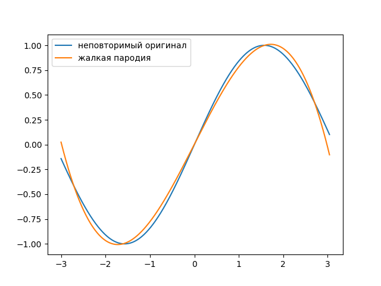

# Decomposition of a function into a Fourier series.

## Run example
### Install requirements
```
pip3 install -r requirements.txt
```

### Run code

```
python examples/standart_decompose_to_fourier_series.py -2 2 "x**2" 4
```

### Result:


### Command line arguments
```
python examples/standart_decompose_to_fourier_series.py <interval_start: int> <interval_end: int> <expression of the expanded function: str> <harmonics num: int>
```

## Try to change basis

For example i will use this basis:
1) x^2
2) x
3) -x
4) x ** 3
5) 1 / max(x, 1)

To create this basis in code:
```python
class MyBasis(NonOrthogonalBasis):
    ELEMENTS = [
        lambda x1: x1 ** 2,
        lambda x2: x2,
        lambda x3: -x3,
        lambda x4: x4 ** 3,
        lambda x5: 1 / max(x5, 1),
    ]

    def stupid_get_item(self, n: int) -> Func:
        return Func(self.ELEMENTS[n])
```

To eliminate the non-orthogonality of elements, we inherit from NonOrthogonalBasis.

### Run code
```
python examples/different_basis.py -3 3 "sin(x)" 4
```

### Result

