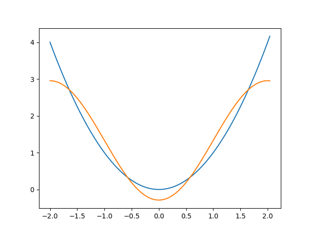

# Decomposition of a function into a Fourier series.

## Install requirements
```
pip3 install -r requirements.txt
```

## Run code

```
python examples/standart_decompose_to_fourier_series.py -2 2 "x**2" 4
```

## Result:



## Command line arguments
```
python examples/standart_decompose_to_fourier_series.py <interval_start: int> <interval_end: int> <expression of the expanded function: str> <harmonics num: int>
```
